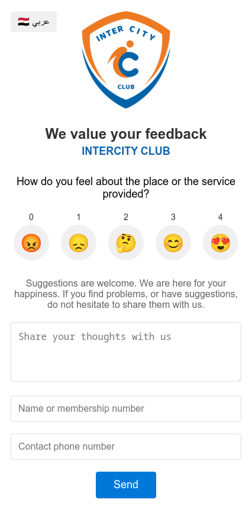

# Inter City Club Feedback

This project is a feedback form for Inter City Club. Users can submit their feedback using emojis and provide additional comments. The feedback is sent to a server and stored in a database, and a notification is sent via Telegram.

## Features

- Emoji-based feedback
- Additional comments
- Name and phone number input
- Automatic language toggle on page load
- SweetAlert2 for error and success messages
- Telegram notifications

## Installation

1. Clone the repository:
    ```bash
    git clone https://github.com/yourusername/feedback.git
    cd feedback
    ```


2. Create a [config.php]() file in the `feedback` directory with the following content:
    ```php
    <?php
    return [
        'telegramBotToken' => 'YOUR_TELEGRAM_BOT_TOKEN',
        'telegramChatIds' => [
            'YOUR_TELEGRAM_CHAT_ID'
            // You can add more chat IDs
        ],
        'db' => [
            'servername' => 'localhost',
            'username' => 'YOUR_DB_USERNAME',
            'password' => 'YOUR_DB_PASSWORD',
            'dbname' => 'YOUR_DB_NAME'
        ]
    ];
    ?>
    ```

3. Make sure to add [config.php]() to your [.gitignore]() file to avoid pushing sensitive information to the repository.
3. Upload files to the designated file path on the server.

## Usage

1. Open project URL in your browser.
2. The language will toggle automatically based on the user's preference.
3. Fill in the feedback form with your rating, comments, name, and phone number.
4. Click the submit button to send your feedback.

## Screenshot



## License

This project is licensed under the MIT License.